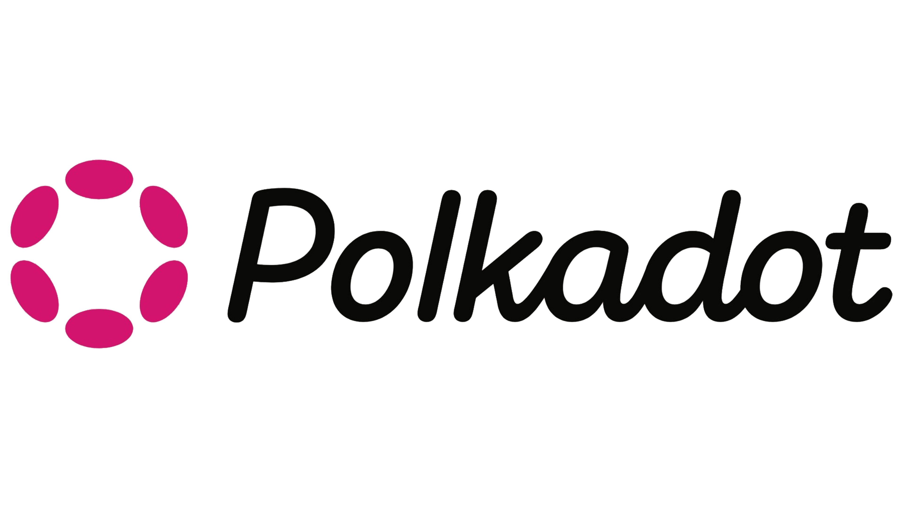

<div align="center">
  

  # ✨ Substrate MCP Server ✨

  An MCP (Model Context Protocol) server that provides tools for working with Substrate-based blockchains.
</div>

## Table of Contents

- [📖 About](#-about)
- [🛠️ Prerequisites](#-prerequisites)
- [⬇ Installation](#-installation)
  - [Quick Install](#quick-install)
  - [Download from Releases](#download-from-releases)
  - [Install from Source (Requires cargo)](#install-from-source)
  - [Build Locally (Requires cargo)](#build-locally)
- [🤖 Usage with Claude Code](#-usage-with-claude-code)
- [🎛️ Configuration](#%EF%B8%8F-configuration)
  - [GitHub API Rate Limits](#github-api-rate-limits)
- [⚙️ Available Tools](#-available-tools)
  - [Release Analysis](#release-analysis)
  - [Chain Exploration](#chain-exploration)
  - [Extrinsic Operations](#extrinsic-operations)
- [🚀 Available Prompts](#-available-prompts)
  - [Polkadot SDK Release Analysis](#polkadot-sdk-release-analysis)
    - [release_comparison](#release_comparison)
    - [analyze_release](#analyze_release)
    - [polkadot_upgrade](#polkadot_upgrade)
  - [Development & Scaffolding](#development--scaffolding)
    - [scaffold_pallet](#scaffold_pallet)
  - [Security Analysis](#security-analysis)
    - [security_review](#security_review)
- [📜 License](#-license)

## 📖 About
Substrate MCP is a Rust-based Model Context Protocol server for the [Polkadot](https://polkadot.com/) ecosystem.
It lets AI agents explore chain metadata and state, decode extrinsics, submit dev extrinsics, scaffold pallets, and analyze [Polkadot SDK](https://polkadot.com/platform/sdk/) releases to understand their impact on your codebase.

## 🛠 Prerequisites

- [Rust Toolchain](https://www.rust-lang.org/tools/install)

- For the `subxt_execute` tool, install the subxt CLI:

```bash
cargo install subxt-cli
```

## ⬇ Installation
Choose one of the following installation methods:

### Quick Install

```bash
curl -sSfL https://raw.githubusercontent.com/Moonsong-Labs/substrate-mcp/main/install.sh | bash
```

This will:
- Download the appropriate binary for your platform
- Install it to `~/.substrate-mcp/bin/substrate-mcp`
- Add the binary to your PATH

### Download from Releases

Download the binary for your platform from the [latest release](https://github.com/Moonsong-Labs/substrate-mcp/releases/latest).

### Install from Source

```bash
cargo install --locked --git https://github.com/Moonsong-Labs/substrate-mcp
```

### Build Locally

```bash
git clone https://github.com/Moonsong-Labs/substrate-mcp.git
cd substrate-mcp
cargo build --release
```

The binary will be available at `./target/release/substrate-mcp`

## 🤖 Usage with Claude Code

To use this MCP server with Claude Code, add it to your Claude Code configuration.

```json
{
  "mcpServers": {
    "substrate-mcp": {
      "command": "substrate-mcp"
    }
  }
}
```

If you built the server locally instead of installing it, use the full path:

```json
{
  "mcpServers": {
    "substrate-mcp": {
      "command": "/path/to/substrate-mcp/target/release/substrate-mcp"
    }
  }
}
```

Alternatively, add via CLI:

```bash
claude mcp add substrate /path/to/substrate-mcp/target/release/substrate-mcp
```

## 🎛️ Configuration

### GitHub API Rate Limits

Some tools (like `fetch_and_analyze_release` and `list_polkadot_releases`) make requests to the GitHub API. Without authentication, you're limited to 60 requests per hour. For higher rate limits (5,000 requests/hour), set a GitHub token:

```bash
export GITHUB_TOKEN="your_github_personal_access_token"
```

To generate a token:

1. Go to [GitHub Settings > Personal access tokens](https://github.com/settings/tokens)
2. Click "Generate new token" > "Generate new token (classic)"
3. No special permissions required - just create a basic token
4. Copy the token and set it in your environment

For Claude Code, you can set environment variables in your configuration:

```json
{
  "mcpServers": {
    "substrate-mcp": {
      "command": "substrate-mcp",
      "env": {
        "GITHUB_TOKEN": "your_github_personal_access_token"
      }
    }
  }
}
```

## ⚙️ Available Tools

### Release Analysis

- **`fetch_and_analyze_release`** - Fetches and analyzes a Polkadot SDK release - downloads PRDocs and generates summaries (manifest, crate changes, audience breakdown)
- **`list_polkadot_releases`** - List all available Polkadot SDK releases from the polkadot-sdk repository. Helps discover valid release identifiers before using other tools. Supports filtering by release type (stable, legacy, or all)

### Chain Exploration

- **`subxt_execute`** - Use subxt to decode and explore Substrate blockchain data. Useful for: analyzing chain metadata structure, generating type-safe Rust code for chain interactions, exploring available pallets/calls/storage/events, decoding extrinsics and storage values, and understanding runtime APIs
- **`filter_metadata`** - Filter and search chain metadata to discover available pallets, storage entries, calls, events, constants, and errors. Supports partial name matching for easy discovery
- **`query_extrinsics`** - Query extrinsics from blocks. Supports filtering by pallet, call name, and signer address. Returns decoded transaction data including signer, call info, and arguments
- **`query_events`** - Query events from blocks. Supports querying by pallet and event name. Returns event details such as pallet name, event index and data. Supports relative block numbers (e.g., -10 for 10 blocks ago)
- **`query_storage`** - Query chain storage entries by pallet and storage name. Supports querying map-type storage with keys. Use this to read chain state like account balances, staking info, or governance proposals
- **`list_pallet_storage`** - List all storage entries available in a specific pallet. Use this to discover what storage items are available before querying them

### Extrinsic Operations

- **`submit_dev_extrinsic`** - Submit a generic extrinsic to a Substrate chain using dev accounts. Supports any pallet call with arbitrary arguments. Use dev account names like 'alice', 'bob', 'charlie', etc. for signing

## 🚀 Available Prompts

The Substrate MCP server provides several specialized prompts for Substrate development and security analysis:

### Polkadot SDK Release Analysis

#### release_comparison

**Description**: List changes between two polkadot-sdk release versions
**Arguments**:

- `current_version` (required): Version currently being used
- `target_version` (required): Version dev wants to compare with (must be greater than current)
- `specific_changes` (optional): What specific changes to look for (e.g: was there any change in `pallet_treasury` ?)

#### analyze_release

**Description**: Analyze how specific release(s) impact your current project
**Arguments**:

- `release` (required): The release version(s) to analyze. Examples: 'stable2503-7' for single release, 'stable2502,stable2503' for comparison
- `focus` (optional): Specific aspect to focus on (e.g., 'breaking changes', 'migrations', 'security'). Leave empty for comprehensive analysis

#### polkadot_upgrade

**Description**: User and agent discovery and discussion on what is needed to upgrade polkadot version in your substrate client and runtime
**Arguments**:

- `release` (required): Release name/version to analyze
- `focus` (optional): Specific area to focus analysis on

### Development & Scaffolding

#### scaffold_pallet

**Description**: Generate pallet structure and implementation templates
**Arguments**:

- `pallet_description` (required): Description for the pallet

### Security Analysis

#### security_review

**Description**: Security review covering code security, economic threats, and performance analysis
**Arguments**:

- `target` (required): Target component/pallet/system to review

This prompt combines code security audit, economic security assessment, threat modeling, and weight analysis into a comprehensive security review. NOTE: This prompt is designed to be used during development as a tool to provide an extra layer of analysis. It is not meant to replace professional security audits.

## 📜 License

This Project is licenced under the Apache License. See the  [LICENSE](LICENSE) file for details
