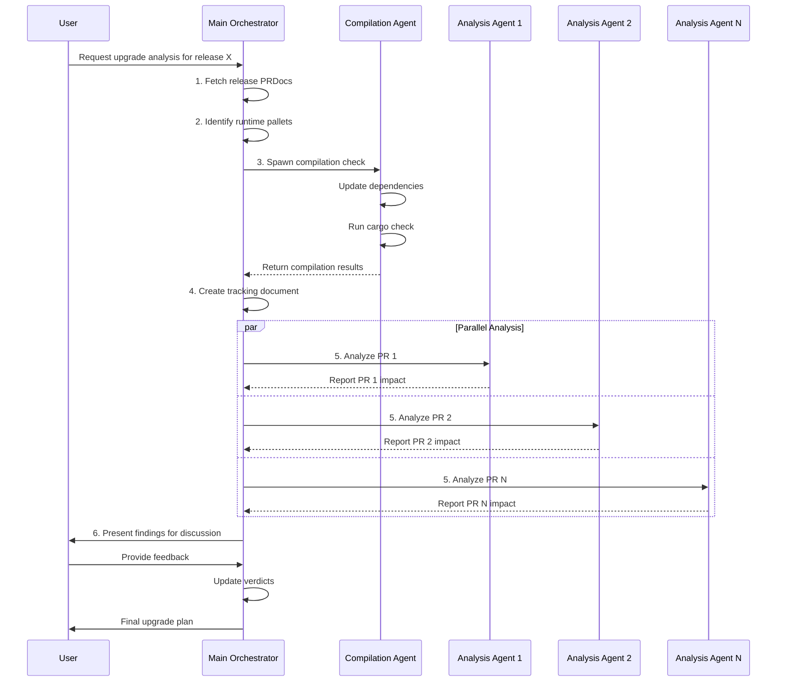

# Polkadot SDK Upgrade Analysis Prompt

This prompt helps Substrate-based blockchain projects analyze the impact of upgrading to a new Polkadot SDK release. It provides a systematic, evidence-based approach to understanding which changes require immediate action versus those that are optional or automatically inherited.

## Overview

The prompt acts as a Principal Blockchain Engineer that coordinates multiple sub-agents to:

- Test if the upgrade compiles
- Analyze every PR in the release for impact
- Categorize changes as MUST, OPTIONAL, INHERITED, or DON'T KNOW
- Provide concrete evidence and file-level references for all findings

## Workflow

The workflow is divided among three types of agents, each with specific responsibilities:

```mermaid
graph TB
    Start[User invokes prompt with release version]

    subgraph MAIN["🎯 MAIN ORCHESTRATOR AGENT"]
        direction TB
        M1[Step 1: Prime Release Context<br/>Uses: fetch_and_analyze_release]
        M2[Step 2: Prime Project Context<br/>Uses: find_runtime_pallets]
        M3[Step 3: Spawn Compilation Sub-Agent]
        M4[Step 4: Create Tracking Document<br/>Initialize MD file with tables]
        M5[Step 5: Spawn Analysis Sub-Agents<br/>One per PR - Parallel execution]
        M6[Step 6: Refinement Discussion<br/>Interactive with user]
        M7[Final Consensus and Verdicts]

        M1 --> M2
        M2 --> M3
        M3 --> M4
        M4 --> M5
        M5 --> M6
        M6 --> M7
    end

    subgraph COMP["🔧 COMPILATION SUB-AGENT"]
        direction TB
        C1[Update Cargo.toml dependencies]
        C2[Run cargo check --all-targets]
        C3[Capture ONLY errors<br/>not warnings]
        C4[Report compilation results]

        C1 --> C2
        C2 --> C3
        C3 --> C4
    end

    subgraph ANALYSIS["📊 ANALYSIS SUB-AGENTS<br/>(One per PR)"]
        direction TB
        A1[Step 1: Review compilation results<br/>if relevant to this PR]
        A2[Step 2: Read PRDoc content]
        A3[Step 3: Analyze GitHub labels]
        A4[Step 4: WebFetch PR description<br/>and migration guides]
        A5[Step 5: WebFetch PR diff<br/>github.com/.../pull/XXX/files]
        A6[Step 6: Grep project codebase<br/>for API usage]
        A7[Step 7: Determine Impact Category]

        A1 --> A2
        A2 --> A3
        A3 --> A4
        A4 --> A5
        A5 --> A6
        A6 --> A7

        subgraph CAT[Impact Categories]
            MUST[MUST<br/>Breaking changes in use]
            OPT[OPTIONAL<br/>New features not used]
            INH[INHERITED<br/>Internal changes only]
            DK[DONT KNOW<br/>Unclear impact]
        end

        A7 --> CAT
    end

    Start --> MAIN
    M3 -.->|spawns| COMP
    M5 -.->|spawns multiple| ANALYSIS
    COMP -.->|results to| M4
    ANALYSIS -.->|reports to| M6

    style MAIN fill:#e1f5fe
    style COMP fill:#fff3e0
    style ANALYSIS fill:#f3e5f5
```



### Agent Interaction Sequence



## Key Components

### 1. Main Orchestrator

The primary agent that coordinates the entire workflow:

- Fetches release information and PR documentation
- Spawns specialized sub-agents for specific tasks
- Maintains the tracking document
- Facilitates discussion with the user

### 2. Compilation Sub-Agent

Tests if the project compiles with the new dependencies:

- Updates all polkadot-sdk dependencies in `Cargo.toml`
- Runs `cargo check --all-targets`
- Reports ONLY compilation errors (not warnings)
- Provides a summary of what broke

### 3. Analysis Sub-Agents

Individual agents spawned in parallel for each PR:

- Read PRDoc files for change descriptions
- Fetch GitHub PR details and discussions
- Search project codebase for usage of affected APIs
- Cross-reference with compilation errors
- Categorize impact with concrete evidence

## Impact Categories

### MUST

Changes requiring immediate action:

- Breaking API changes where the project uses affected APIs
- Removed functionality currently in use
- Required migration steps
- **Evidence**: Compilation errors, grep results showing usage, file:line references

### OPTIONAL

Enhancements available but not required:

- New optional features or pallets
- Additional helper functions
- New configuration options
- **Evidence**: Negative grep results confirming non-usage

### INHERITED

Automatically inherited through dependency update:

- Internal optimizations
- Bug fixes that don't change behavior
- Performance improvements
- **Evidence**: PR analysis showing no API changes

### DON'T KNOW

Unclear impact requiring human review:

- Complex transitive dependencies
- Ambiguous breaking changes
- Missing documentation
- **Evidence**: Document what was searched and why it remains unclear

## Evidence-Based Analysis

The prompt requires concrete evidence for all determinations:

### Types of Evidence

- **Compilation errors** - Strongest signal of breaking changes
- **Code search results** - Shows actual usage in the project
- **PR documentation** - Migration guides and breaking change notes
- **Dependency analysis** - Which crates/pallets are affected
- **Configuration changes** - Required settings updates
- **API modifications** - Function signature changes

### Confidence Levels

- **HIGH**: Multiple corroborating sources
- **MEDIUM**: Clear evidence from 1-2 sources
- **LOW**: Indirect evidence or pattern-based assumptions

## Output Format

### Tracking Document

A markdown file containing:

1. **Project Context** - Runtime pallets and configuration
2. **Compilation Results** - Errors from dependency upgrade attempt
3. **PR Tracking Table** - Status and analysis of each PR

### PR Analysis Reports

Each PR analysis includes:

- PR information with GitHub links
- Impact assessment with confidence level
- Affected components listing
- Specific changes detected
- Project impact with file:line references
- Evidence from both polkadot-sdk and the project
- Migration guides if available

## Usage

```rust
// Invoke the prompt with a release version
PolkadotUpgradeArgs {
    release: "stable2412-1".to_string(),
}
```

The prompt handles various release formats:

- `stable2412-1` - Standard format
- `polkadot-stable2412-1` - Git tag format (automatically normalized)
- `1.9.0` - Semantic version format

## Benefits

1. **Comprehensive** - Analyzes every single PR in the release
2. **Evidence-based** - All findings backed by concrete code references
3. **Efficient** - Parallel analysis of PRs
4. **Actionable** - Clear categorization of what needs immediate attention
5. **Traceable** - File:line references for all impacts
6. **Interactive** - Collaborative refinement with the user

## Implementation Details

The prompt is implemented using:

- **Handlebars templates** for dynamic content generation
- **Sub-agent delegation** for parallel processing
- **Tool integration** (`fetch_and_analyze_release`, `find_runtime_pallets`, `Grep`, `WebFetch`, `Read`)
- **Structured reporting** with markdown tables and formatted output

This systematic approach ensures that upgrade decisions are based on concrete evidence rather than assumptions, making the upgrade process more reliable and less error-prone.
